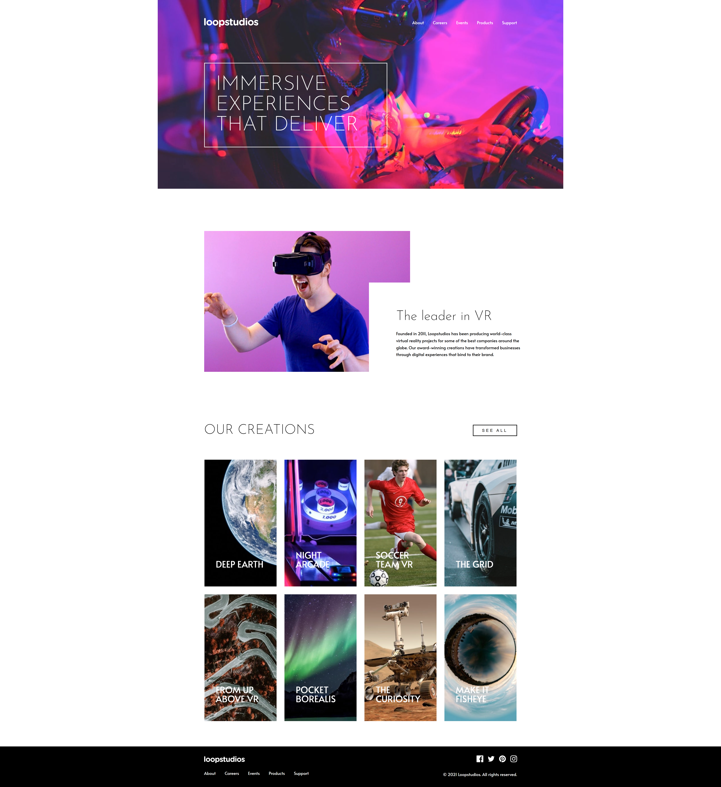

# Frontend Mentor - Loopstudios landing page solution

This is a solution to the [Loopstudios landing page challenge on Frontend Mentor](https://www.frontendmentor.io/challenges/loopstudios-landing-page-N88J5Onjw).

## Overview

### The challenge

Users should be able to:

- View the optimal layout depending on their device's screen size
- See hover and focus states for interactive elements
- Open and close the navigation menu on mobile devices
- Navigate the page using a keyboard

### Screenshot

### Links

- Solution URL: [Frontend Mentor solution](https://www.frontendmentor.io/challenges/loopstudios-landing-page-N88J5Onjw)
- Live Site URL: [Live site](https://visockijanatolij1-sys.github.io/loopstudios-landing-page/)

## My process

### Built with

- Semantic HTML5 markup
- SCSS
- Flexbox
- Responsive design
- CSS media queries
- JavaScript
- Mobile-first navigation
- Accessible interactive elements

### What I learned

The main challenge in this project was building the responsive layout while keeping the structure manageable across desktop and mobile screen sizes.

I practiced creating overlapping sections without letting absolute positioning control the entire page layout. I also worked with responsive image-based cards and switched between desktop and mobile assets at different breakpoints.

The mobile navigation gave me additional practice with JavaScript state management. I used class toggling to control the menu and burger icon, while also updating accessibility attributes such as `aria-expanded` and `aria-label`.

I also improved the accessibility of the page by adding keyboard focus states, using semantic buttons for interactive controls, and providing accessible names for social links.

## Author

- Frontend Mentor - [@visockijanatolij1-sys](https://www.frontendmentor.io/profile/visockijanatolij1-sys)